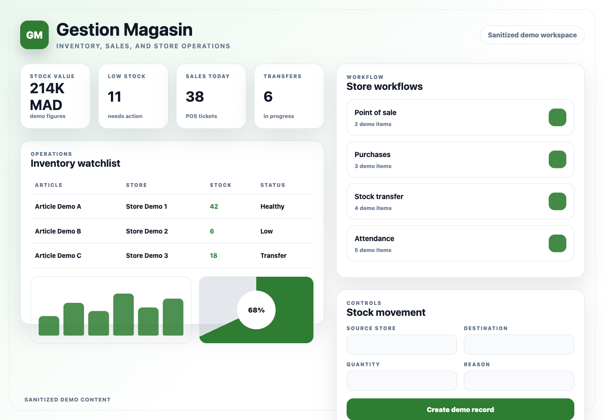

# Gestion Magasin Backend

## Purpose

Gestion Magasin Backend is the Django API for store operations. It manages catalog data, stock, stores, sales, purchases, finance, attendance, reporting, notifications, and websocket events.

## Stack

- Python and Django
- Django REST Framework
- Simple JWT and dj-rest-auth
- django-filter
- Channels, Daphne, Redis, and Celery
- PostgreSQL
- ReportLab and OpenPyXL
- Pytest and pytest-django

## Features

- Product catalog and inventory APIs
- Store stock, transfers, purchases, and sales
- Point-of-sale and promotion data
- Finance and attendance records
- Reporting endpoints
- Notifications and websocket updates

## Setup

Provide local-only variables for Django runtime settings, database, Redis, media storage, and allowed origins. Use localhost values for local development and do not commit local configuration files.

```bash
python -m venv .venv
source .venv/bin/activate
pip install -r requirements.txt
python manage.py migrate
python manage.py runserver 8006
```

## Tests

```bash
python -m pytest
```

## Screenshots

Sanitized product workspace:



Authentication screen:


